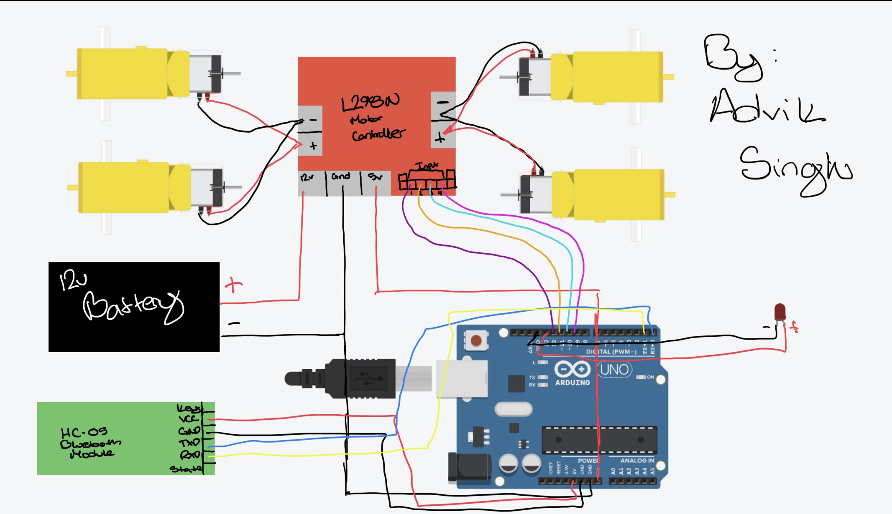

# Arduino Bluetooth RC Car

An Arduino-based RC car controlled via Bluetooth using an HC-05 module and an L298N motor driver.  
This project allows you to drive the car forward, backward, left, right, diagonally, and even perform a **smooth stop** instead of an abrupt halt.

---

## Features
- Control car movement with Bluetooth commands.  
- Smooth stop mechanism for gradual braking.  
- Adjustable motor speed via PWM.  
- LED control (on/off) through Bluetooth.  
- Compatible with **Arduino UNO/Nano** + **HC-05** + **L298N**.

---

## Controls
| Command | Action |
|---------|--------|
| `F` | Move Forward |
| `B` | Move Backward |
| `L` | Turn Left |
| `R` | Turn Right |
| `C` | Diagonal Left |
| `A` | Diagonal Right |
| `S` | Smooth Stop |
| `s` | LED ON |
| `O` | LED OFF |

---

## Hardware Required
- Arduino Uno/Nano: 
- HC-05 Bluetooth module: 
- L298N motor driver: 
- 2 or 4 DC motors + wheels: 
- Battery pack (7–12V recommended): 
- Chassis(I used thick cardboard) + jumper wires:  
- LED (optional): [Amazon Link](https://www.amazon.com/California-JOS-50-PCS-Colorful/dp/B0CR886L92/ref=sr_1_4?crid=2G5WW7YP6XO1X&dib=eyJ2IjoiMSJ9.D-FZ38nN8aYf_T0FMLvBT5U8AEF7YUYdftEfJlolABI9cTufg9hPAOjWvKkNrigDPmDWo3i7rR097uZ_efwNuxVdA6vlnRXEzJ_uXfoC0nwSyeFDjKHIUWyIEQ34oDyZvNq6ruYAYr0PjAppdAilDu_y3kcZPjkxMBYTToEYaJxTx1ElDnmmdbYBFW0Gz_uvK6BcwvJlByM6Ulp3BUQn1KgZKNyPOVAr6B0dVefyHTM.pAaBlZ1m3PNpXooLXv8uHOu0h7cfflKVCrpYdFe8oks&dib_tag=se&keywords=led%2Barduino&qid=1758754630&sprefix=led%2Barduino%2Caps%2C129&sr=8-4&th=1)

---

## Circuit Connections
- **Motor A:** IN1 → D12, IN2 → D11, ENA → D6  
- **Motor B:** IN3 → D10, IN4 → D9, ENB → D5  
- **LED:** D13  
- **Bluetooth HC-05:** TX → Arduino RX, RX → Arduino TX, VCC → 5V, GND → GND  

---

## Schematics
Here’s the wiring diagram for the project:  

---

## Setup & Usage
1. Upload the provided code to your Arduino.  
2. Pair your HC-05 Bluetooth module with your smartphone (default password: `1234` or `0000`).  
3. Open a Bluetooth controller app (e.g., **Arduino Bluetooth Controller** or **Serial Bluetooth Terminal**).  
4. Send commands from your phone to control the car.
